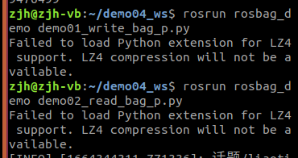

# MY_ROS
 有关于ROS的一些东西

```
├─assets
├─其他
│  └─环境配置类
│      └─assets
├─第五章
│  └─assets
├─第四章
│  └─assets
└─麦克纳姆轮独立悬挂底盘
    ├─2022_9月组装终稿
    ├─origin
    │  ├─减震架
    │  └─加工格式
    ├─零件
    ├─零件2.0
    ├─零件3.0
    └─零件4.0
```

##### 机械臂详见：https://gitee.com/parker-zer0/ros_mechanical_arm.git

# 学习日志

## 9.13~9.18

1.制作了底盘轴承测支架（在 其他-底盘-零件轴承侧支架）

2.主要学习了launch文件的使用

## 9.18~9.20

1.为了后续有关于分布式通信的学习又重新配置了一个Ubuntu

​	同时写了教程（在 其他-环境配置类下）

## 9.20~9.22

1.重新制作了合页连接板

2.学习了**分布式通信内容**

遗留问题：如何在使用（虚拟机）桥接网络的情况下实现网络的正常使用

## 9.23~9.28

1.学习了rosbag

遗留问题：



## 9.29

1.将前面半个月的底盘组装完成

## 9.30~10.7

1.接收到了有关于后续制作机械臂的任务

2.学习了rqt工具箱

##### 关于机械臂详细可见https://gitee.com/parker-zer0/ros_mechanical_arm.git
## 10.8

1.整理了有关于 国庆期间研究的机械臂 以及 底盘制造的资料

2.开始学习 机器人系统仿真
