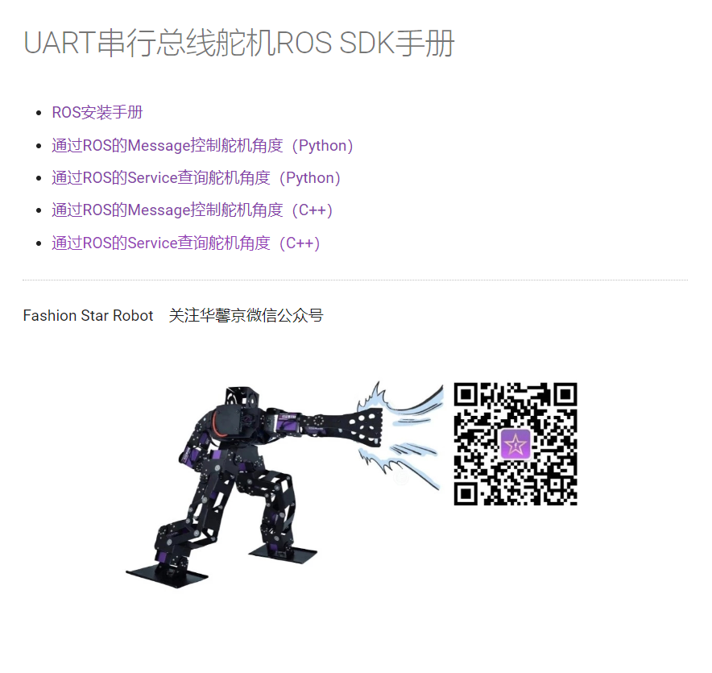

## 9.30

```makefile
根据官网教程，编写机械臂指令接收端ROS节点
https://wiki.fashionrobo.com
要求实现功能:
1.一次性能接受三个电机的运动参数，同时运动。
2.有对应指令一键恢复初始状态
3.自行编写发送端进行测试
4.接收端可以先用python，再改写成c++，或直接使用C++
```

另外：

1.电池保证不要过放（两片芯有一个<3.4就去充电，短期可救回），正常冲到7.8即可

2.舵机可以串联

3.板子放在机械臂下面（如果可以的话）

4.看UART串行总线舵机ROS SDK手册

