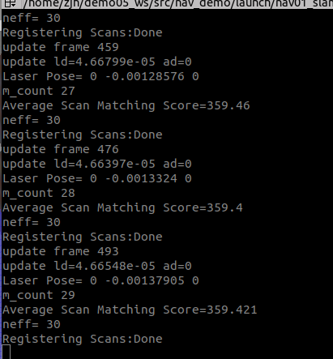
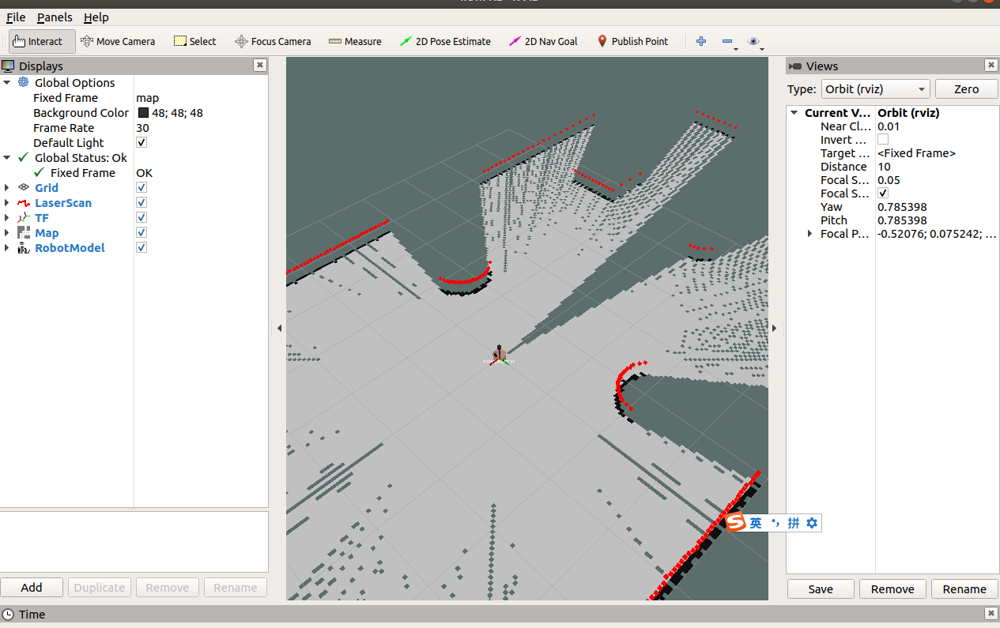
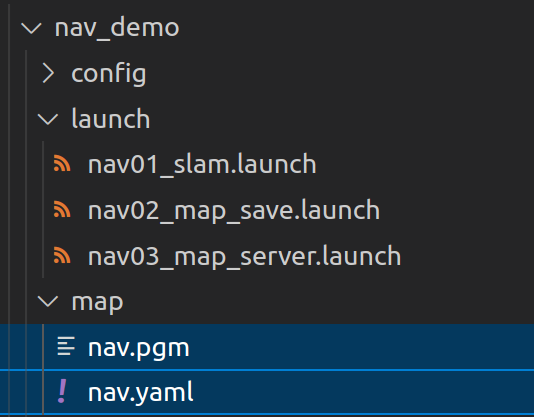
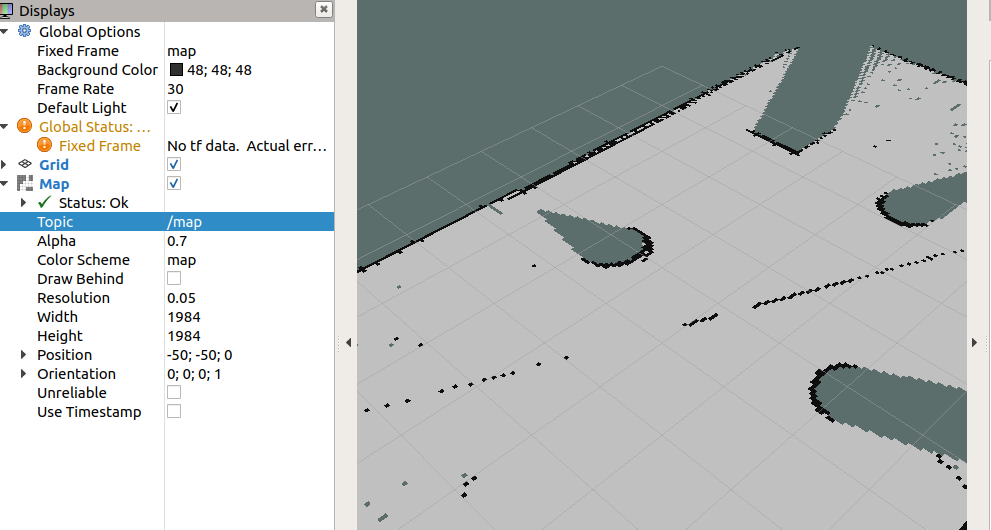
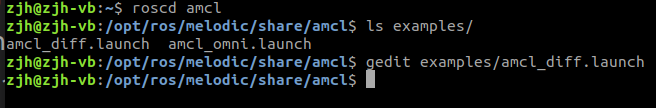
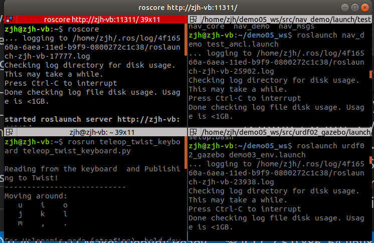
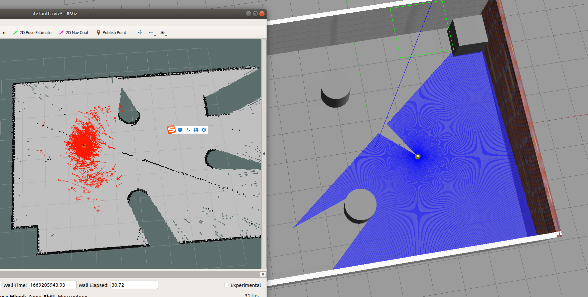
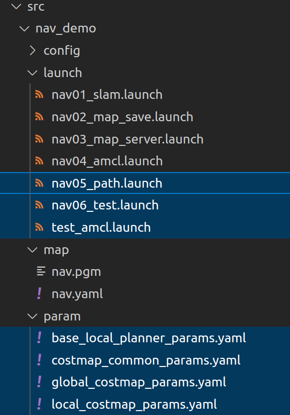
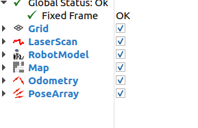
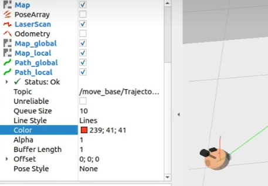

## P300~P301SLAM_gampping-建图

gampping的安装：`sudo apt install ros-<ROS版本>-gmapping`

新建功能包`nav_demo`，并导入依赖: `gmapping map_server amcl move_base`

> nav01_slam.launch

```markdown
<launch>
        <param name="use_sim_time" value="true"/>
        <node pkg="gmapping" type="slam_gmapping" name="slam_gmapping" output="screen">
                <remap from="scan" to="scan"/>

                <param name="base_frame" value="base_footprint"/>
                <param name="map_frame" value="map"/>
                <param name="odom_frame" value="odom"/>

                <param name="map_update_interval" value="5.0"/>
                <param name="maxUrange" value="16.0"/>
                <param name="sigma" value="0.05"/>
                <param name="kernelSize" value="1"/>
                <param name="lstep" value="0.05"/>
                <param name="astep" value="0.05"/>
                <param name="iterations" value="5"/>
                <param name="lsigma" value="0.075"/>
                <param name="ogain" value="3.0"/>
                <param name="lskip" value="0"/>
                <param name="srr" value="0.1"/>
                <param name="srt" value="0.2"/>
                <param name="str" value="0.1"/>
                <param name="stt" value="0.2"/>
                <param name="linearUpdate" value="1.0"/>
                <param name="angularUpdate" value="0.5"/>
                <param name="temporalUpdate" value="3.0"/>
                <param name="resampleThreshold" value="0.5"/>
                <param name="particles" value="30"/>
                <param name="xmin" value="-50.0"/>
                <param name="ymin" value="-50.0"/>
                <param name="xmax" value="50.0"/>
                <param name="ymax" value="50.0"/>
                <param name="delta" value="0.05"/>
                <param name="llsamplerange" value="0.01"/>
                <param name="llsamplestep" value="0.01"/>
                <param name="lasamplerange" value="0.005"/>
                <param name="lasamplestep" value="0.005"/>
        </node>
        <node pkg="joint_state_publisher" name="joint_state_publisher" type="joint_state_publisher" />
        <node pkg="robot_state_publisher" name="robot_state_publisher" type="robot_state_publisher" />
        <node pkg="rviz" type="rviz" name="rviz"/>
</launch>
```

再保证开启之前的仿真环境课控制节点的情况下

```markdown
roslaunch urdf02_gazebo demo03_env.launch
rosrun teleop_twist_keyboard teleop_twist_keyboard.py
```

再开启

```markdown
roslaunch nav_demo nav01_slam.launch
```



再rivz中配置好对应的选项，并保存



## P302-SLAM保存图

在保证开启之前的仿真环境课控制节点的情况下

```markdown
roslaunch urdf02_gazebo demo03_env.launch
rosrun teleop_twist_keyboard teleop_twist_keyboard.py
```

再开启

```markdown
roslaunch nav_demo nav01_slam.launch
roslaunch nav_demo nav02_map_save.launch
```


> nav02_map_save.launch

```markdown
<launch>
    <arg name="filename" value="$(find nav_demo)/map/nav" />
    <node name="map_save" pkg="map_server" type="map_saver" args="-f $(arg filename)" />
</launch>
```

其中保存下来的两个文件

pgm相当于图片，yaml为地图描述文件



## P303-SLAM读取图

> nav03_map_server.launch

```markdown
<launch>

        <arg name="map" default="nav.yaml" />
        <node pkg="map_server" type="map_server" name="map_server" args="$(find nav_demo)/map/$(arg map)" />

</launch>
```

> 这里尽量把上一节启动的终端关闭，重新打开

首先启动用于读取的launch

```markdown
roslaunch nav_demo nav03_map_server.launch
```

再使用

```
rviz
```

通过打开rviz，添加map组件并调整map的话题接收名称来查看之前保存的地图



## P304-yaml文件

```
#1.声明地图图片资源的路径
image: /home/zjh/demo05_ws/src/nav_demo/map/nav.pgm
#2.地图刻度尺，单位为 米/像素
resolution: 0.050000
#3.地图的位置信息（相对于rviz中原点的位置）
origin: [-50.000000, -50.000000, 0.000000]
#4.是否取反
negate: 0
#5.占用阈值，像素占用率大于这个阈值则认为完全占用（有障碍物）。
occupied_thresh: 0.65
#6.空闲阈值，像素占用率比该阈值小被则认为完全自由（无障碍物）。
free_thresh: 0.196
```

地图中的白色区域是可通行区域；黑色区域是障碍物；蓝灰色是未知区域

## P305~P306-amcl定位

首先确保安装好对应组件`sudo apt install ros-<ROS版本>-navigation`

通过如下命令查看

```markdown
roscd amcl
ls examples/
gedit examples/amcl_diff.launch
```

(针对ls的内容，diff指的是差速控制，omni是全向控制)



将`amcl_diff.launch`中的内容复制到nav04_amcl.launch中，并针对需要进行修改

```markdown
<launch>
        <node pkg="amcl" type="amcl" name="amcl" output="screen">
                <!-- Publish scans from best pose at a max of 10 Hz -->
                <param name="odom_model_type" value="diff"/>
                <param name="odom_alpha5" value="0.1"/>
                <param name="transform_tolerance" value="0.2" />
                <param name="gui_publish_rate" value="10.0"/>
                <param name="laser_max_beams" value="30"/>
                <param name="min_particles" value="500"/>
                <param name="max_particles" value="5000"/>
                <param name="kld_err" value="0.05"/>
                <param name="kld_z" value="0.99"/>
                <param name="odom_alpha1" value="0.2"/>
                <param name="odom_alpha2" value="0.2"/>
                <!-- translation std dev, m -->
                <param name="odom_alpha3" value="0.8"/>
                <param name="odom_alpha4" value="0.2"/>
                <param name="laser_z_hit" value="0.5"/>
                <param name="laser_z_short" value="0.05"/>
                <param name="laser_z_max" value="0.05"/>
                <param name="laser_z_rand" value="0.5"/>
                <param name="laser_sigma_hit" value="0.2"/>
                <param name="laser_lambda_short" value="0.1"/>
                <param name="laser_lambda_short" value="0.1"/>
                <param name="laser_model_type" value="likelihood_field"/>
                <!-- <param name="laser_model_type" value="beam"/> -->
                <param name="laser_likelihood_max_dist" value="2.0"/>
                <param name="update_min_d" value="0.2"/>
                <param name="update_min_a" value="0.5"/>
                <param name="odom_frame_id" value="odom"/>
                <param name="resample_interval" value="1"/>
                <param name="transform_tolerance" value="0.1"/>
                <param name="recovery_alpha_slow" value="0.0"/>
                <param name="recovery_alpha_fast" value="0.0"/>
        </node>
</launch>
```


> test_amcl.launch

```markdown
<launch>
        <node pkg="joint_state_publisher" name="joint_state_publisher" type="joint_state_publisher" />
        <node pkg="robot_state_publisher" name="robot_state_publisher" type="robot_state_publisher" />
        <node pkg="rviz" type="rviz" name="rviz"/>

        <include file="$(find nav_demo)/launch/nav03_map_server.launch"/>

        <include file="$(find nav_demo)/launch/nav04_amcl.launch"/>
</launch>
```

上述过程主要分为启动rviz，加载地图服务，加载amcl文件

依次执行

```
roslaunch urdf02_gazebo demo03_env.launch
roslaunch nav_demo test_amcl.launch
rosrun teleop_twist_keyboard teleop_twist_keyboard.py
```



下面红色箭头越密集，表示车子出现的概率越高



## P306~P308-move_base简介

move_base 功能包提供了基于动作(action)的路径规划实现，而action不同于服务通信，action可以在运动过程中连续反馈机器人的当前状态

## P309~P311-move_base与代价地图

代价地图有两张:global_costmap(全局代价地图) 和 local_costmap(本地代价地图)，前者用于全局路径规划，后者用于本地路径规划。

两张代价地图都可以多层叠加,一般有以下层级:

- Static Map Layer：静态地图层，SLAM构建的静态地图。
- Obstacle Map Layer：障碍地图层，传感器感知的障碍物信息。
- Inflation Layer：膨胀层，在以上两层地图上进行膨胀（向外扩张），以避免机器人的外壳会撞上障碍物。
- Other Layers：自定义costmap。

## P312-move_base使用流程

创建好以下文件



运行

```
rosrun teleop_twist_keyboard teleop_twist_keyboard.py
roslaunch nav_demo nav06_test.launch
roslaunch urdf02_gazebo demo03_env.launch
```

在rviz中配置好对应的相关组件（主要是相关话题）



点击rviz页面上方的`2D Nav Goal`，并点击地图中的灰色位置，即可看到车慢慢的向目标点移动




以上配置在实操中，可能会出现机器人在本地路径规划时与全局路径规划不符而进入膨胀区域出现假死的情况，如何尽量避免这种情形呢？

> 全局路径规划与本地路径规划虽然设置的参数是一样的，但是二者路径规划和避障的职能不同，可以采用不同的参数设置策略:
>
> - 全局代价地图可以将膨胀半径和障碍物系数设置的偏大一些；
> - 本地代价地图可以将膨胀半径和障碍物系数设置的偏小一些。
>
> 这样，在全局路径规划时，规划的路径会尽量远离障碍物，而本地路径规划时，机器人即便偏离全局路径也会和障碍物之间保留更大的自由空间，从而避免了陷入“假死”的情形。

## P317导航仿真

> nav07_slam_auto.launch

```markdown
<launch>
        <include file="$(find nav_demo)/launch/nav01_slam.launch"/>
        
        <include file="$(find nav_demo)/launch/nav05_path.launch"/>
</launch>
```

