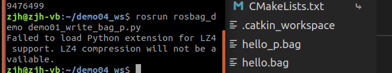
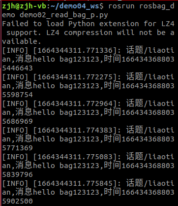

# Rosbag

> 此部分主要针对教学视频的P216~P221

## P216 Rosbag简介

机器人传感器获取到的信息，有时我们可能需要时时处理，有时可能只是采集数据，事后分析，比如:

> 机器人导航实现中，可能需要绘制导航所需的全局地图，地图绘制实现，有两种方式，方式1：可以控制机器人运动，将机器人传感器感知到的数据时时处理，生成地图信息。方式2：同样是控制机器人运动，将机器人传感器感知到的数据留存，事后，再重新读取数据，生成地图信息。两种方式比较，显然方式2使用上更为灵活方便。

在ROS中关于数据的留存以及读取实现，提供了专门的工具: rosbag。

___

### **概念**

是用于**录制和回放** ROS 主题的一个工具集。

### **作用**

实现了数据的复用，方便调试、测试。

### **本质**

rosbag本质也是ros的节点，当录制时，rosbag是一个订阅节点，可以订阅话题消息并将订阅到的数据写入磁盘文件；当重放时，rosbag是一个发布节点，可以读取磁盘文件，发布文件中的话题消息。

___

**另请参考:**

-   [http://wiki.ros.org/rosbag]

## P217 命令行的使用

> ROS 内置的乌龟案例并操作，操作过程中使用 rosbag 录制，录制结束后，实现重放

### 1.准备 

我们首先创建一个文件夹来专门保存录制的文件——`bags`

仍按照

```
roscore
rosrun turtlesim turtlesim_node 
rosrun turtlesim turtle_teleop_key
```

的顺序激活乌龟

### 2.开始录制

```
rosbag record -a -O 目标文件
```

其中，`record`表示录制，`-a`表示针对所有的话题消息，`-o`表示针对输出，目标文件的格式需要包括文件的名称+`.bag`。如rosbag record -a -o bags/hello.bag

操作小乌龟一段时间，结束录制使用 ctrl + c，在创建的目录中会生成bag文件。


### 3.查看文件

```
rosbag info 文件名
```

可以看到有如下信息


### 4.回放文件

```markdown
rosbag play 文件名
```

重启乌龟节点，会发现，乌龟按照录制时的轨迹运动。

> 如果前三个命令保持不关闭，则会把播放前的状态作为起始点
>
> 也可以先关闭`turtlesim_node`重新打开，重新运行并播放就可以得到一样的运动轨迹


___

**另请参考:**

-   [http://wiki.ros.org/rosbag/Commandline]

## P218 使用C++录制rosbag文件

```c++
#include "ros/ros.h"
#include "rosbag/bag.h"
#include "std_msgs/String.h"

/*
    需求：使用rosbag向磁盘文件写出数据（话题+消息）
    流程：
        1.导包
        2.初始化操作
        
        3.创建rosbag对象
        4.打开文件流
        
        5.写数据
        6.关闭文件流
*/

int main(int argc, char *argv[])
{
    // 2.初始化操作
    setlocale(LC_ALL,"");
    ros::init(argc,argv,"bag_write");
    ros::NodeHandle nh;

    // 3.创建rosbag对象
    rosbag::Bag bag;

    // 4.打开文件流
    bag.open("hello.bag",rosbag::BagMode::Write);

    // 5.写数据
    std_msgs::String msg;
    msg.data = "hello xxx";
    //话题名称+消息发布时间(时间戳)+消息
    bag.write("/chatter",ros::Time::now(),msg);

    // 6.关闭文件流
    bag.close();
    return 0;
}
```

​	在成功执行之后，会看到在`demo04_ws`的文件夹下出现`hello.bag`文件


> 注意    **bag.open("hello.bag",rosbag::BagMode::Write);**和**bag.write("/chatter",ros::Time::now(),msg);**别打错了，否则会出现下面的报错（我是两个都打错了。痛，太痛了）

​	

## P219 使用C++播放rosbag文件

```C++
#include "ros/ros.h"
#include "rosbag/bag.h"
#include "rosbag/view.h"
#include "std_msgs/String.h"
#include "std_msgs/Int32.h"

/*
    需求：使用rosbag向磁盘文件写出数据（话题+消息）
    流程：
        1.导包
        2.初始化操作
        
        3.创建rosbag对象
        4.打开文件流
        
        5.写数据
        6.关闭文件流
*/

int main(int argc, char *argv[])
{
    //2.初始化
    setlocale(LC_ALL,"");
    
    ros::init(argc,argv,"bag_read");
    ros::NodeHandle nh;

    //3.创建rosbag对象
    rosbag::Bag bag;
    //4.打开 bag 文件
    bag.open("hello.bag",rosbag::BagMode::Read);
    //5.读数据
    for (auto &&m : rosbag::View(bag))
    {
        //解析
        std::string topic = m.getTopic();//获取话题
        ros::Time time = m.getTime();//获取时间戳

        std_msgs::StringPtr p = m.instantiate<std_msgs::String>();
        ROS_INFO("解析的内容,话题：%s,时间戳:%.2f,消息值:%s",
                topic.c_str(),
                time.toSec(),
                p->data.c_str()
        );
    }

    //关闭文件流
    bag.close();
    return 0;
}

```

> 成功执行之后


## P220 使用Python录制rosbag文件

```python
#! /usr/bin/env python3

import rospy
import rosbag
from std_msgs.msg import String

"""
需求：写出消息数据到磁盘上的 bag文件
    流程：
        1.导包
        2.初始化
        3.创建rosbag对象并打开文件流
        4.写数据
        5.关闭流
"""
if __name__=="__main__":
    #2.初始化
    rospy.init_node("write_bag_p")
    # 3.创建rosbag对象并打开文件流
    bag = rosbag.Bag("hello_p.bag","w")#文件名+写操作（“w”）
    # 4.写数据
    msg=String()
    msg.data = "hello bag123123"
    bag.write("/liaotian",msg)
    bag.write("/liaotian",msg)
    bag.write("/liaotian",msg)
    bag.write("/liaotian",msg)
    bag.write("/liaotian",msg)
    bag.write("/liaotian",msg)
    # 5.关闭流
    bag.close()
```

### 如果出现了报错

按照教程来走

执行完`rosrun……`命令后我估计八成会出现下面的问题


或者这个问题


这里按照提示，对应安装即可

> 这个是我在物理机的Ubuntu20.04上尝试成功的，后面重新创建了18.04的虚拟机试验后成功的

```
sudo apt install python3-pycryptodome
```

```
pip install pycryptodome
```

```
pip3 install pycryptodomex
```

### 执行完上述三个命令后



这里仍会出现提示，但是我们可以看到文件已经成功生成了

> 目前没有找到更合适的解决办法，如果后面找到了，我会及时更新

### 如果没有出现报错

> 我只能说：教教我！！！

## P221 使用Python播放rosbag文件

```python
#! /usr/bin/env python3
import rospy
import rosbag
from std_msgs.msg import String
"""
    需求：读取磁盘上的 bag 文件
    流程：
        1.导包
        2.初始化
        3.创建 rosbag 对象并且打开文件流
        4.读数据
        5.关闭文件流

"""
if __name__ == "__main__":
    # 2.初始化节点 
    rospy.init_node("read_bag_p")

    # 3.创建 rosbag 对象并且打开文件流
    bag = rosbag.Bag("hello_p.bag",'r')
    # 4.读数据
    msgs = bag.read_messages("/liaotian")
    for topic,msg,time in msgs:
        rospy.loginfo("话题%s,消息%s,时间%s",topic,msg.data,time)
    # 5.关闭流
    bag.close()

```

> 这里我为了检测是否会被LZ4影响到而更改了里面的内容，所以是hello bag123123

