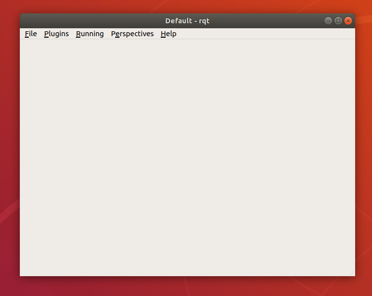
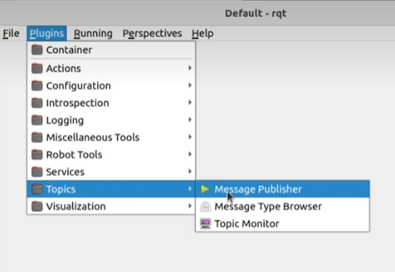
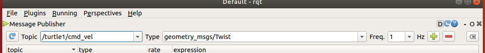
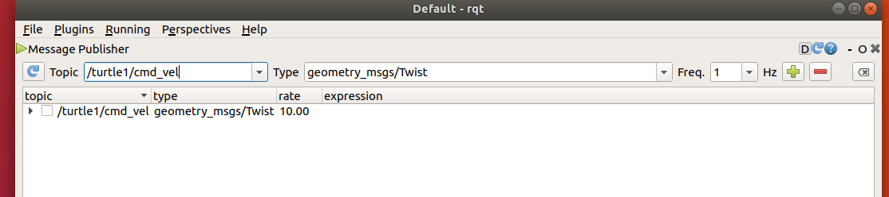
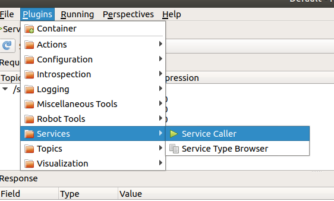
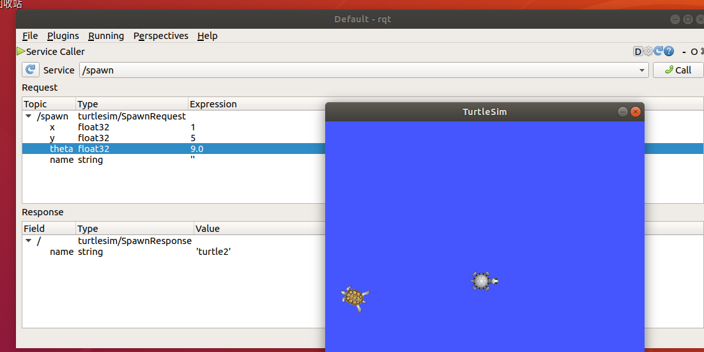
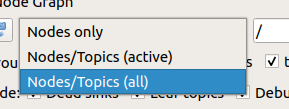

# rqt常用组件

> 此部分主要针对教学视频的P223~P228

## P222,P223

rqt的启动方式:

1.`rqt`

2.`rosrun rqt_gui rqt_gui`

打开之后可以看到如下的界面



##### 以`话题通讯`为例



在跑完 `rosrun turtlesim turtlesim_node`之后

按照如下进行选择



点击右边绿色的加号



点击展开新出现的选项，就可以对对应小乌龟设置位置，设置角速度等东西了

##### 以 `参数服务器` 为例





在设置好参数之后，点击右侧的**call**，就可以在对应位置生成对象了

## P224-rqt_graph

​	在使用`rqt`之后，可以在“Plugins - Introspection - Node Graph”中进行打开，从而打开 **可视化显示计算图**


> 视频中用到了之前的坐标操作，具体就不写了
>
> 想要显示所有节点，记得选择all



## P225-rqt_console

> rqt_console 是 ROS 中用于显示和过滤日志的图形化插件

```C++
/*  
    ROS 节点:输出各种级别的日志信息

*/
#include "ros/ros.h"

int main(int argc, char *argv[])
{
    ros::init(argc,argv,"log_demo");
    ros::NodeHandle nh;

    ros::Rate r(0.3);
    while (ros::ok())
    {
        ROS_DEBUG("Debug message d");
        ROS_INFO("Info message oooooooooooooo");
        ROS_WARN("Warn message wwwww");
        ROS_ERROR("Erroe message EEEEEEEEEEEEEEEEEEEE");
        ROS_FATAL("Fatal message FFFFFFFFFFFFFFFFFFFFFFFFFFFFF");
        r.sleep();
    }


    return 0;
}

```


# 遇到未知问题，一跑就出错
