# 机器人系统仿真

> 针对教学视频P229~P288

## P233-基本流程

##### 1.创建项目

创建`demo05_ws`,在里面创建`src`，再在终端中使用`catkin_make`指令，使用`code .`打开

再配置`c_cpp_properties.json`

```json
{
  "configurations": [
    {
      "browse": {
        "databaseFilename": "${default}",
        "limitSymbolsToIncludedHeaders": false
      },
      "includePath": [
        "/opt/ros/melodic/include/**",
        "/usr/include/**"
      ],
      "name": "ROS",
      "intelliSenseMode": "gcc-x64",
      "compilerPath": "/usr/bin/gcc",
      "cStandard": "gnu11",
      "cppStandard": "c++17"
    }
  ],
  "version": 4
}
```

##### 2.创建新的功能包并导入依赖

包名`urdf01_rviz`,依赖：`urdf` `xacro`

依次创建好下列文件夹

> config：存储配置类文件

> launch：即launch文件存储

> meshes：用于保存后续机器人的皮肤/模型

> urdf：用于后续存储urdf文件


> 注意下面两步文件层级关系
>
> 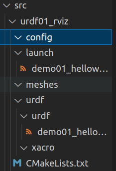

##### 3.编写URDF文件

```markdown
<robot name="mycar">
    <link name="base_link">
        <visual>
            <geometry>
                <box size="0.5 0.2 0.1" />
            </geometry>
        </visual>
    </link>
</robot>

```

##### 4.在 launch 文件中集成 URDF 与 Rviz

```markdown
<launch>

    <!-- 1.在参数服务器中载入 urdf 文件（设置参数），textfile用于指向urdf文件 -->
    <param name="robot_description" textfile="$(find urdf01_rviz)/urdf/urdf/urdf01_helloworld.urdf" />

    <!-- 2.启动 rviz -->
    <node pkg="rviz" type="rviz" name="rviz" />

</launch>

```

总终端中跑`roslaunch urdf01_rviz demo01_helloworld.launch`即可,可以看到如下界面

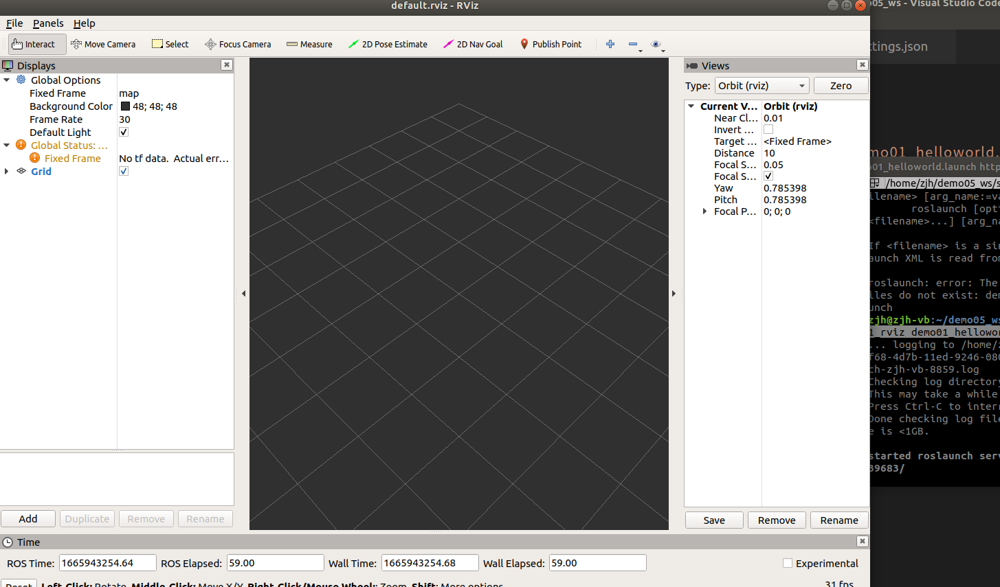

##### 5.在 Rviz 中显示机器人模型

点击左下角的`Add`，向下找到`RobotModel`，点击OK，即可生成

此时会发现有报错

在`Fixed Frame`中将`map`更改为之前的`urdf`中的`link name`（这里是`base_link`）

再进行相同的添加方式，添加`Axes`（这里叫直角坐标系）

即可看到如下界面（其中红：x轴，绿：y轴，蓝：z轴）

> 也可以和solidworks一样进行旋转，但操作方式不同

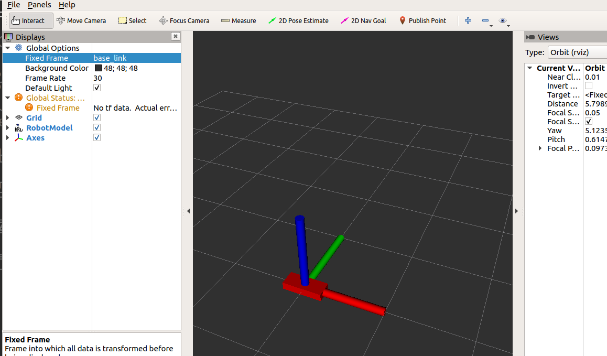

## P234-优化rviz启动

> 首先是保存，我这里的名字为`show_mycar.rviz`放在了之前创建的`config`文件夹下

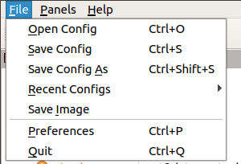

> 再是启动

在原来`demo01_helloworld.launch`中间添加`args="-d $(find urdf01_rviz)/config/show_mycar.rviz"`

即：

```markdown
<launch>

    <!-- 1.在参数服务器中载入 urdf 文件（设置参数），textfile用于指向urdf文件 -->
    <param name="robot_description" textfile="$(find urdf01_rviz)/urdf/urdf/demo01_helloworld.urdf" />

    <!-- 2.启动 rviz -->
    <node pkg="rviz" type="rviz" name="rviz" args="-d $(find urdf01_rviz)/config/show_mycar.rviz" />

</launch>
```

即可读取对应的文件

直接就可以看到之前保存前的界面

## P235~P236-link

机器人组成主要分为`连杆`（**link**）和`关节`（**joint**）两种

连杆可见，而关节不可见

> 还有**robot**标签，相当于launch文件中的launch标签
>
> gazebo标签，继承gazebo需要使用的标签，在后面的gazebo仿真时才需要使用到，用于配置仿真环境所需的参数（仅在需要仿真时才需要设计）

## P237~P239-link标签

用于描述机器人的某个部件（即刚体部分）的外观和物理属性


**Collision**：`碰撞参数`（即游戏中的碰撞体积）

**Visual**：`可视化部分`，如形状，尺寸，颜色等

**Inertial**:`惯性矩阵`，可以调整惯性参数，质量，重心

#### 1.属性

- name ---> 为连杆命名

#### 2.子标签

- visual ---> 描述外观(对应的数据是可视的)
    - geometry 设置连杆的形状
        - 标签1: box(盒状)
            - 属性:size=长(x) 宽(y) 高(z)
        - 标签2: cylinder(圆柱)
            - 属性:radius=半径 length=高度
        - 标签3: sphere(球体)
            - 属性:radius=半径
        - 标签4: mesh(为连杆添加皮肤)
            - 属性: filename=资源路径(格式:**package://<packagename>/<path>/文件**)
    - origin 设置偏移量与倾斜弧度
        - 属性1: xyz=x偏移 y便宜 z偏移
        - 属性2: rpy=x翻滚 y俯仰 z偏航 (单位是弧度)
    - metrial 设置材料属性(颜色)
        - 属性: name
        - 标签: color
            - 属性: rgba=红绿蓝权重值与透明度 (每个权重值以及透明度取值[0,1])
- collision ---> 连杆的碰撞属性
- Inertial ---> 连杆的惯性矩阵

> 这里只讲了visual部分，下面为圆柱的效果图（之前的坐标系没删掉）

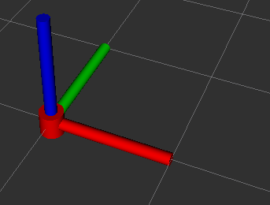

> 在讲关于导入皮肤的时候说有一个素材（在6.1），我放在了和这个markdown文件同级下
>
> 或者去github上下载也可以：https://github.com/zx595306686/sim_demo.git

注意好文件和launch文件内容的层级关系即可

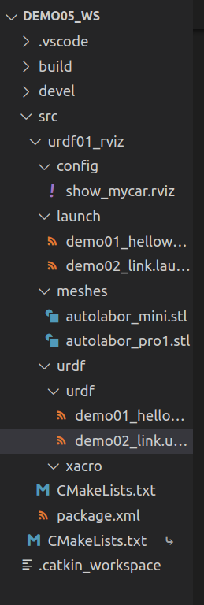

> 其中`<material name="black">`的**name**不知道影响在哪里

```markdown
<!-- 需求：设置不同形状的机器人部件 -->
<robot name = "mycar">
    <link name = "base_link">
        <!--可视化标签-->
        <visual>
            <!-- 1.设置形状 -->
            <geometry>
                <!-- 1.1 立方体,分别对应x,y,z -->
                <!-- <box size ="0.3 0.2 0.1" /> -->

                <!-- 1.2圆柱 -->
                <!-- <cylinder radius = "0.1" length = "0.2" /> -->

                <!-- 1.3球体 -->
                <!-- <sphere radius="0.3" /> -->

                <!-- 1.4添加皮肤 -->
                <mesh filename = "package://urdf01_rviz/meshes/autolabor_mini.stl"/>
            </geometry>
            <!-- 2.偏移量与倾斜弧度 -->
                <!-- xyz用于设置机器人在 x y z 上的偏移量
                rpy用于设置倾斜弧度 x(翻滚) y（俯仰） z（偏航）
                都为0的时候与没有设置没有区别
                (3.14=180度 1.57=90度) -->
            <!-- <origin xyz = "0 0 0" rpy = "0 0 0" /> -->
            <origin xyz = "3 2 1" rpy = "1.57 3.14 2" />

            <!-- 3.设置颜色 -->
            <!-- 颜色: r=red g=green b=blue a=alpha(透明度) 
            均在[0,1]之间-->
            <material name="car_color">
                <color rgba="0.7 0.5 0 0.5" />
            </material>
        </visual>
    </link>
</robot>
```

## P240~P245-Joint标签


#### 1.属性

- name ---> 为关节命名
- type ---> 关节运动形式
    - continuous: 旋转关节，可以绕单轴无限旋转
    - revolute: 旋转关节，类似于 continues,但是有旋转角度限制
    - prismatic: 滑动关节，沿某一轴线移动的关节，有位置极限
    - planer: 平面关节，允许在平面正交方向上平移或旋转
    - floating: 浮动关节，允许进行平移、旋转运动
    - fixed: 固定关节，不允许运动的特殊关节

#### 2.子标签

- parent(必需的)

    parent link的名字是一个强制的属性：

    - link:父级连杆的名字，是这个link在机器人结构树中的名字。

- child(必需的)

    child link的名字是一个强制的属性：

    - link:子级连杆的名字，是这个link在机器人结构树中的名字。

- origin

    - 属性: xyz=各轴线上的偏移量 rpy=各轴线上的偏移弧度。

- axis

    - 属性: xyz用于设置围绕哪个关节轴运动。

在`demo03_jiont.urdf`中

> 注意：在**melodic**中，不能出现中文注释，否则在后面的**launch**文件中仍然会出现相同的报错

```markdown
<robot name="mycar">
    <link name="base_link">
        <visual>
            <geometry>
                <box size="0.5 0.2 0.1" />
            </geometry>
            <origin xyz="0 0 0" rpy="0 0 0" />
            <material name="car_color">
                <color rgba="0.8 0.5 0 0.5" />
            </material>
        </visual>
    </link>

    <link name="camera">
        <visual>
            <geometry>
                <box size="0.02 0.05 0.05" />
            </geometry>
            <origin xyz="0 0 0" rpy="0 0 0" />
            <material name="camera_color">
                <color rgba="0 0 1 0.5" />
            </material>
        </visual>
    </link>

    <joint name="camera2base" type="continuous">
        <parent link="base_link"/>
        <child link="camera" />
        <origin xyz="0.2 0 0.075" rpy="0 0 0" />
        <axis xyz="0 0 1" />
    </joint>

</robot>

```

> **demo03_jiont.launch**文件

```markdown
<launch>

    <!-- 1.在参数服务器中载入 urdf 文件（设置参数），textfile用于指向urdf文件 -->
    <param name="robot_description" textfile="$(find urdf01_rviz)/urdf/urdf/demo03_joint.urdf" />

    <!-- 2.启动 rviz -->
    <node pkg="rviz" type="rviz" name="rviz" args="-d $(find urdf01_rviz)/config/show_mycar.rviz" />

    <!-- 只有上述两条语句的话：
    表现：设置头显示位置与颜色异常
    提示：No transform from [camera] to [base_link]  ->缺少camera到base_link的坐标变换
    原因：rviz中显示Urdf的时候，必须发布不同部件之间的坐标系关系
    解决：ROS中提供了关于机器人模型显示的坐标发布的相关节点（需要有两个） -->

    <!-- 添加关节状态发布节点 -->
    <!-- <node pkg="joint_state_publisher" type="joint_state_publisher" name="joint_state_publisher" /> -->
    <!-- 添加机器人状态发布节点   P242中所讲的关节的连接-->
    <node pkg="robot_state_publisher" type="robot_state_publisher" name="robot_state_publisher" />

    <!-- 添加用于控制关节运动的节点  P243中用于关节运动，但是要注释掉joint_state_publisher,否则会使摄像头鬼畜-->
    <node pkg="joint_state_publisher_gui" type="joint_state_publisher_gui" name="joint_state_publisher_gui" />

</launch>
```

> 如果想要得到P243中的`joint_state_publisher_gui`窗口，需要跑一下这个，注意好版本号
>
> ```
> sudo apt-get install ros-kinetic-joint-state-publisher-gui
> ```

## P246~P250-urdf练习

> demo05_test.launch文件

```markdown
<launch>
    <!-- 1.在服务器中载入urdf -->
    <param name = "robot_description" textfile = "$(find urdf01_rviz)/urdf/urdf/demo05_test.urdf"/>

    <!-- 2.启动rviz -->
    <node pkg = "rviz"  name = "rviz" type = "rviz" args = "-d $(find urdf01_rviz)/config/show_mycar.rviz"/>

    <!-- 3.添加关节状态发布节点 -->
    <node pkg = "joint_state_publisher"  name = "joint_state_publisher" type = "joint_state_publisher"/>

    <!-- 4.添加机器人状态发布节点 --> 
    <node pkg = "robot_state_publisher"  name = "robot_state_publisher" type = "robot_state_publisher"/>

    <!-- 5.关节运动控制节点 -->
    <node pkg = "joint_state_publisher_gui"  name = "joint_state_publisher_gui" type = "joint_state_publisher_gui"/>


</launch>
```

> demo05_test.urdf

```markdown
<robot name="mycar">

    <link name="base_footprint">
        <visual>
            <geometry>
                <sphere radius="0.001" />
            </geometry>
        </visual>
    </link>


        <link name="base_link">
        <visual>
            <geometry>
                <cylinder radius="0.1" length="0.08" />
            </geometry>
            <origin xyz="0 0 0" rpy="0 0 0" />
            <material name="yellow">
                <color rgba="0.8 0.3 0.1 0.5" />
            </material>
        </visual>
    </link>

    <joint name="base_link2base_footprint" type="fixed">
        <parent link="base_footprint" />
        <child link="base_link"/>
        <origin xyz="0 0 0.055" />
    </joint>

        <link name="left_wheel">
        <visual>
            <geometry>
                <cylinder radius="0.0325" length="0.015" />
            </geometry>
            <origin xyz="0 0 0" rpy="1.5705 0 0" />
            <material name="black">
                <color rgba="0.0 0.0 0.0 1.0" />
            </material>
        </visual>

    </link>

    <joint name="left_wheel2base_link" type="continuous">
        <parent link="base_link" />
        <child link="left_wheel" />
        <origin xyz="0 0.1 -0.0225" />
        <axis xyz="0 1 0" />
    </joint>


    <link name="right_wheel">
        <visual>
            <geometry>
                <cylinder radius="0.0325" length="0.015" />
            </geometry>
            <origin xyz="0 0 0" rpy="1.5705 0 0" />
            <material name="black">
                <color rgba="0.0 0.0 0.0 1.0" />
            </material>
        </visual>

    </link>

    <joint name="right_wheel2base_link" type="continuous">
        <parent link="base_link" />
        <child link="right_wheel" />
        <origin xyz="0 -0.1 -0.0225" />
        <axis xyz="0 1 0" />
    </joint>
    


    <link name="front_wheel">
        <visual>
            <geometry>
                <sphere radius="0.0075" />
            </geometry>
            <origin xyz="0 0 0" rpy="0 0 0" />
            <material name="black">
                <color rgba="0.0 0.0 0.0 1.0" />
            </material>
        </visual>
    </link>

    <joint name="front_wheel2base_link" type="continuous">
        <parent link="base_link" />
        <child link="front_wheel" />
        <origin xyz="0.0925 0 -0.0475" />
        <axis xyz="1 1 1" />
    </joint>

    <link name="back_wheel">
        <visual>
            <geometry>
                <sphere radius="0.0075" />
            </geometry>
            <origin xyz="0 0 0" rpy="0 0 0" />
            <material name="black">
                <color rgba="0.0 0.0 0.0 1.0" />
            </material>
        </visual>
    </link>

    <joint name="back_wheel2base_link" type="continuous">
        <parent link="base_link" />
        <child link="back_wheel" />
        <origin xyz="-0.0925 0 -0.0475" />
        <axis xyz="1 1 1" />
    </joint>
</robot>

```

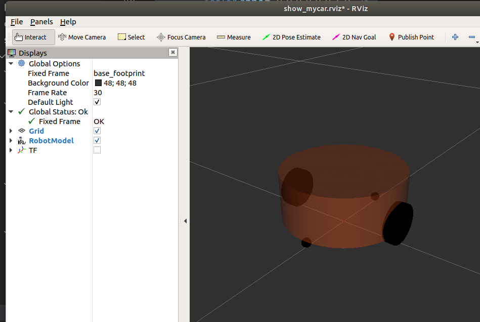

编写过程中建议多次进行保存

如果在保存过程中出现没有权限等情况，类似如下

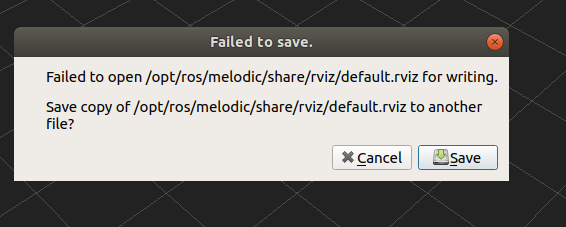

建议检查launch文件”启动rviz“中的文件路径和名称有无发生错误。

如果没有出错，可以试试将文件先保存在其他位置，手动进行覆盖

## P251-URDF工具

> 需要进行安装：`sudo apt install liburdfdom-tools`

- `check_urdf`命令可以检查复杂的 urdf 文件是否存在语法问题
- 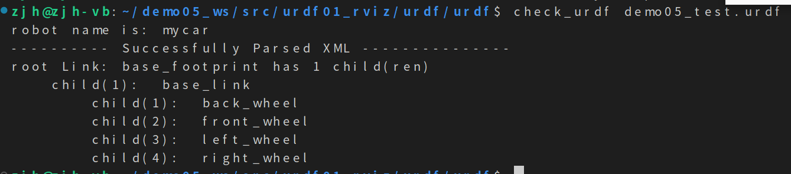
- `urdf_to_graphiz`命令可以查看 urdf 模型结构，显示不同 link 的层级关系

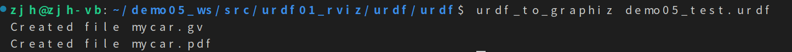

此时可以看到在同级文件夹下的生成的文件

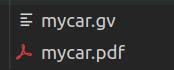

但是在此处无法直接查看，执行`evince mycar.pdf`即可（evince+文件名.pdf）

## P252~P265-xacro

#### 1.Xacro文件编写

编写Xacro文件相当于让各个参数可以使用变量的参数生成urdf文件

```markdown
<robot name="mycar" xmlns:xacro="http://wiki.ros.org/xacro">
    <!-- 属性封装 -->
    <xacro:property name="wheel_radius" value="0.0325" />
    <xacro:property name="wheel_length" value="0.0015" />
    <xacro:property name="PI" value="3.1415927" />
    <xacro:property name="base_link_length" value="0.08" />
    <xacro:property name="lidi_space" value="0.015" />

    <!-- 宏 -->
    <xacro:macro name="wheel_func" params="wheel_name flag" >
        <link name="${wheel_name}_wheel">
            <visual>
                <geometry>
                    <cylinder radius="${wheel_radius}" length="${wheel_length}" />
                </geometry>

                <origin xyz="0 0 0" rpy="${PI / 2} 0 0" />

                <material name="wheel_color">
                    <color rgba="0 0 0 0.3" />
                </material>
            </visual>
        </link>

        <!-- 3-2.joint -->
        <joint name="${wheel_name}2link" type="continuous">
            <parent link="base_link"  />
            <child link="${wheel_name}_wheel" />
            <!-- 
                x 无偏移
                y 车体半径
                z z= 车体高度 / 2 + 离地间距 - 车轮半径

            -->
            <origin xyz="0 ${0.1 * flag} ${(base_link_length / 2 + lidi_space - wheel_radius) * -1}" rpy="0 0 0" />
            <axis xyz="0 1 0" />
        </joint>

    </xacro:macro>
    <xacro:wheel_func wheel_name="left" flag="1" />
    <xacro:wheel_func wheel_name="right" flag="-1" />
</robot>
```

#### 2.Xacro文件转换为urdf文件

```markdown
cd src/urdf01_rviz/urdf/xacro/
rosrun xacro xacro demo01_helloworld.urdf.xacro
rosrun xacro xacro demo01_helloworld.urdf.xacro > demo01_helloworld.urdf
```

第二条可以在终端进行预览

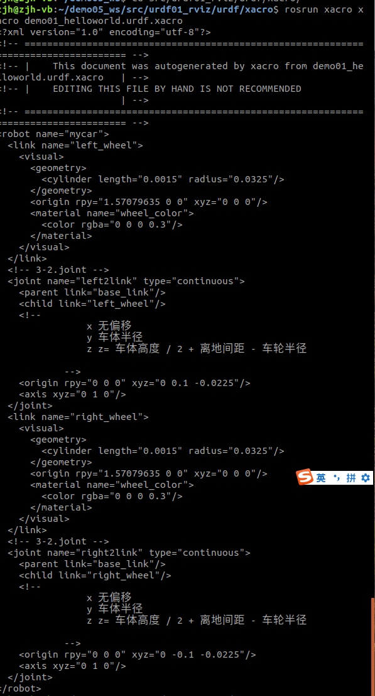

第三条是在同级文件夹下根据xacro文件生成urdf文件

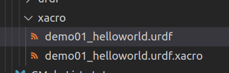

### 根标签

在使用 xacro 生成 urdf 时，根标签`robot`中必须包含命名空间声明:`xmlns:xacro="http://wiki.ros.org/xacro"`

```markdown
<robot name="mycar"xmlns:xacro="http://wiki.ros.org/xacro">
</robot>
```

### 属性(P255)

**属性定义**

```xml
<xacro:property name="xxxx" value="yyyy" />
```

**属性调用**

```markdown
${属性名称}
```

**算数运算**

```markdown
${数学表达式}
```

```markdown
<robot name = "mycar" xmlns:xacro="http://wiki.ros.org/xacro">
    <!-- 1.属性定义 -->
    <xacro:property name = "PI" value = "3.1315927"/>
    <xacro:property name = "radius" value = "0.03"/>
    <!-- 2.属性调用 -->
    <myUsePropertyxxx name = "${PI}" />
    <myUsePropertyxxx name = "${radius}" />
    <!-- 3.算数 -->
    <myUsePropertyYyy name = "${PI / 2}" />
    <myUsePropertyYyy name = "${radius*2}" />
</robot>
```

可以在xacro文件夹下使用`rosrun xacro xacro demo02_field.urdf.xacro`来查看结果

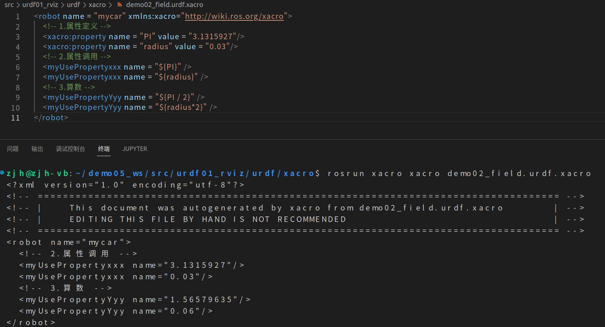

### 宏（P256）

```markdown
<robot name = "mycar" xmlns:xacro="http://wiki.ros.org/xacro">
    <!-- 1.宏定义 -->
    <xacro:macro name = "getSum" params = "num1 num2">
        <result value = "${num1 + num2}"/>
    </xacro:macro>
    <!-- 2.宏调用 -->
    <xacro:getSum num1 = "1" num2 = "5" />
</robot>
```

可以在xacro文件夹下使用`rosrun xacro xacro demo03_macro.urdf.xacro`来查看结果

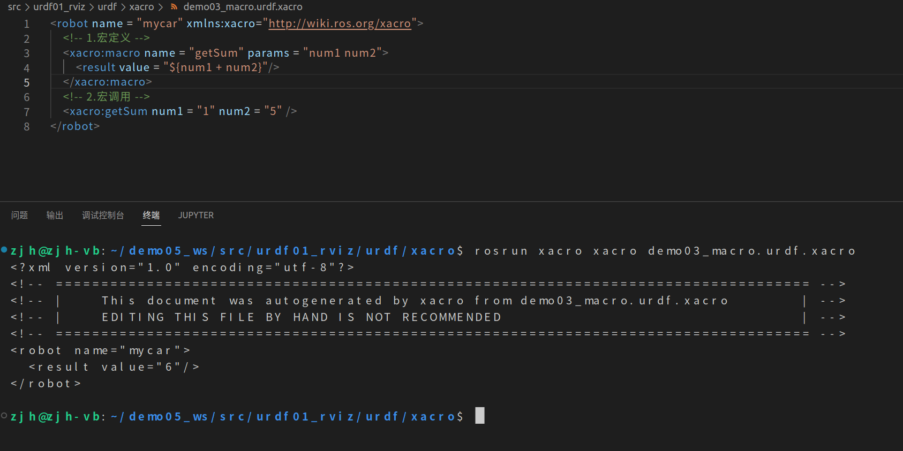

### 文件包含（P257）

```markdown
<robot name = "mycar" xmlns:xacro="http://wiki.ros.org/xacro">
    <!-- 演示文件包含 -->
    <xacro:include filename = "demo02_field.urdf.xacro" />
    <xacro:include filename = "demo03_macro.urdf.xacro" />
</robot>
```

可以在xacro文件夹下使用`rosrun xacro xacro demo04_sum.urdf.xacro`来查看结果

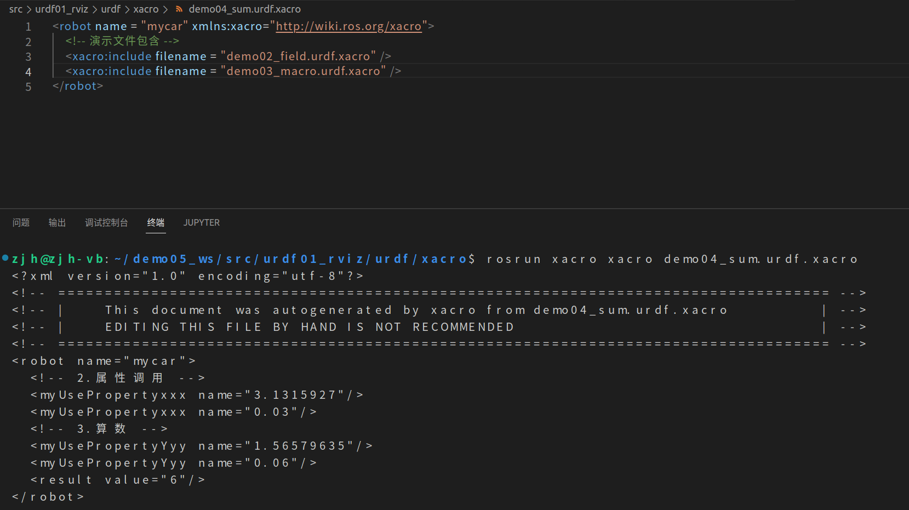

## 完整流程（P258~P260）

##### 1.A 编写xacro文件

```markdown
<robot name="mycar" xmlns:xacro = "http://www.ros.org/wiki/xacro">

  <xacro:property name = "footprint_radius" value = "0.001"/>

  <link name = "base_footprint">
    <visual>
      <geometry>
        <sphere radius = "${footprint_radius}" />
      </geometry>
    </visual>
  </link>

    <xacro:property name = "base_radius" value = "0.1"/>
    <xacro:property name = "base_length" value = "0.8"/>
    <xacro:property name = "lidi" value = "0.015"/>
    <xacro:property name = "base_joint_z" value = "${base_length / 2+lidi}"/>

    <link name="base_link">
        <visual>
            <geometry>
                <cylinder radius="0.1" length="0.08" />
            </geometry>

            <origin xyz="0 0 0" rpy="0 0 0" />

            <material name="yellow">
                <color rgba="0.8 0.3 0.1 0.5" />
            </material>
        </visual>
    </link>

    <joint name="base_link2base_footprint" type="fixed">
        <parent link="base_footprint" />
        <child link="base_link"/>
        <origin xyz="0 0 0.055" />
    </joint>

</robot>
```

> 可以使用`rosrun xacro xacro demo05_car_base.urdf.xacro`来生成，然后使用`check_urdf demo05_car_base.urdf`检测是否成功生成

##### 2.集成launch文件（添加车体）

> 下面将生成步骤也放到了集成launch中

> 在`demo06_car_base.launch`中

```
<launch>
    <!-- 1.在服务器中载入urdf -->
    <!-- 被注释的时前一个版本 -->
    <!-- <param name = "robot_description" command = "$(find urdf01_rviz)/urdf/xacro/demo05_car_base.urdf"/> -->
    <param name = "robot_description" command = "$(find xacro)/xacro $(find urdf01_rviz)/urdf/xacro/demo05_car_base.urdf.xacro"/>

    <!-- 2.启动rviz -->
    <node pkg = "rviz"  name = "rviz" type = "rviz" args = "-d $(find urdf01_rviz)/config/show_mycar.rviz"/>

    <!-- 3.添加关节状态发布节点 -->
    <node pkg = "joint_state_publisher"  name = "joint_state_publisher" type = "joint_state_publisher"/>

    <!-- 4.添加机器人状态发布节点 --> 
    <node pkg = "robot_state_publisher"  name = "robot_state_publisher" type = "robot_state_publisher"/>

    <!-- 5.关节运动控制节点 -->
    <node pkg = "joint_state_publisher_gui"  name = "joint_state_publisher_gui" type = "joint_state_publisher_gui"/>


</launch>
```

`roslaunch urdf01_rviz demo06_car_base.launch`

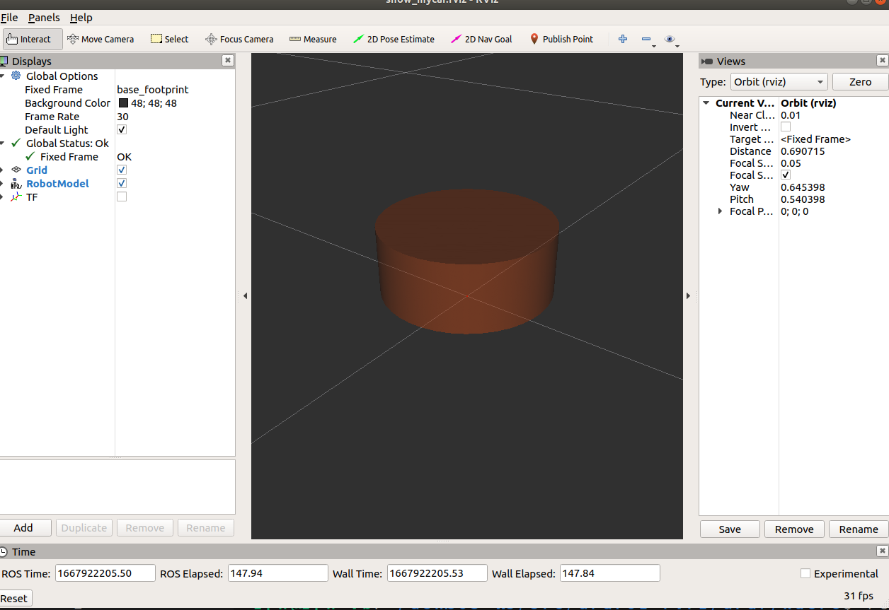

##### 1.B编写xacro文件（添加驱动轮）

> 更改前

```
<robot name="mycar" xmlns:xacro = "http://www.ros.org/wiki/xacro">

  <xacro:property name = "footprint_radius" value = "0.001"/>

  <link name = "base_footprint">
    <visual>
      <geometry>
        <sphere radius = "${footprint_radius}" />
      </geometry>
    </visual>
  </link>

    <xacro:property name = "base_radius" value = "0.1"/>
    <xacro:property name = "base_length" value = "0.8"/>
    <xacro:property name = "lidi" value = "0.015"/>
    <xacro:property name = "base_joint_z" value = "${base_length / 2+lidi}"/>

    <link name="base_link">
        <visual>
            <geometry>
                <cylinder radius="0.1" length="0.08" />
            </geometry>

            <origin xyz="0 0 0" rpy="0 0 0" />

            <material name="yellow">
                <color rgba="0.8 0.3 0.1 0.5" />
            </material>
        </visual>
    </link>

    <joint name="base_link2base_footprint" type="fixed">
        <parent link="base_footprint" />
        <child link="base_link"/>
        <origin xyz="0 0 0.055" />
    </joint>

  <link name = "left_wheel">
    <visual>
      <geometry>
        <cylinder radius = "0.0325" length = "0.015"/>
      </geometry>

      <origin xyz = "0 0 0" rpy = "1.5708 0 0"/>

      <material name = "wheel_color">
        <color rgba = "0 0 0 0.3"/>
      </material>
    </visual>
  </link>
  <link name = "right_wheel">
    <visual>
      <geometry>
        <cylinder radius = "0.0325" length = "0.015"/>
      </geometry>

      <origin xyz="0 0 0" rpy = "1.5708 0 0" />

      <material name = "wheel_color">
        <color rgba = "0 0 0 0.3"/>
      </material>
    </visual>
  </link>

  <joint name = "left2link" type = "continuous">
    <parent link = "base_link"/>
    <child link = "left_wheel"/>
    <origin xyz = "0 0.1 -0.0225" rpy = "0 0 0"/>
    <axis xyz = "0 1 0"/>
  </joint>

    <joint name = "right2link" type = "continuous">
    <parent link = "base_link"/>
    <child link = "right_wheel"/>
    <origin xyz = "0 -0.1 -0.0225" rpy = "0 0 0"/>
    <axis xyz = "0 1 0"/>
  </joint>

</robot>
```

> 修改后

```markdown
<robot name="mycar" xmlns:xacro = "http://www.ros.org/wiki/xacro">

  <xacro:property name = "footprint_radius" value = "0.001"/>

  <link name = "base_footprint">
    <visual>
      <geometry>
        <sphere radius = "${footprint_radius}" />
      </geometry>
    </visual>
  </link>

    <xacro:property name = "base_radius" value = "0.1"/>
    <xacro:property name = "base_length" value = "0.08"/>
    <xacro:property name = "lidi" value = "0.015"/>
    <xacro:property name = "base_joint_z" value = "${base_length / 2+lidi}"/>

    <link name="base_link">
        <visual>
            <geometry>
                <cylinder radius="0.1" length="0.08" />
            </geometry>

            <origin xyz="0 0 0" rpy="0 0 0" />

            <material name="yellow">
                <color rgba="0.8 0.3 0.1 0.5" />
            </material>
        </visual>
    </link>

    <joint name="base_link2base_footprint" type="fixed">
        <parent link="base_footprint" />
        <child link="base_link"/>
        <origin xyz="0 0 0.055" />
    </joint>


<xacro:property name = "wheel_radius" value = "0.0325"/>
<xacro:property name = "wheel_length" value = "0.015"/>
<xacro:property name = "PI" value = "3.1415927"/>
<xacro:property name = "wheel_joint_z" value = "${-base_length/2-lidi+wheel_radius}"/>

<xacro:macro name = "wheel_func" params = "wheel_name flag">
  <link name = "${wheel_name}_wheel">
    <visual>
      <geometry>
        <cylinder radius = "${wheel_radius}" length = "${wheel_length}"/>
      </geometry>

      <origin xyz = "0 0 0" rpy = "${PI / 2} 0 0"/>

      <material name = "wheel_color">
        <color rgba = "0 0 0 0.3"/>
      </material>
    </visual>
  </link>

  <joint name = "${wheel_name}2link" type = "continuous">
    <parent link = "base_link"/>
    <child link = "${wheel_name}_wheel"/>
    <origin xyz = "0 ${0.1* flag} ${wheel_joint_z}" rpy = "0 0 0"/>
    <axis xyz = "0 1 0"/>
  </joint>

  </xacro:macro>

  <xacro:wheel_func wheel_name = "left" flag = "1"/>
  <xacro:wheel_func wheel_name = "right" flag = "-1"/>

</robot>
```

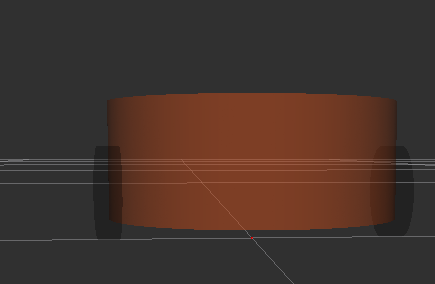

##### 1.C编写xacro文件（添加万向轮）

```markdown
<robot name="mycar" xmlns:xacro = "http://www.ros.org/wiki/xacro">

  <xacro:property name = "footprint_radius" value = "0.001"/>

  <link name = "base_footprint">
    <visual>
      <geometry>
        <sphere radius = "${footprint_radius}" />
      </geometry>
    </visual>
  </link>

    <xacro:property name = "base_radius" value = "0.1"/>
    <xacro:property name = "base_length" value = "0.08"/>
    <xacro:property name = "lidi" value = "0.015"/>
    <xacro:property name = "base_joint_z" value = "${base_length / 2+lidi}"/>

    <link name="base_link">
        <visual>
            <geometry>
                <cylinder radius="0.1" length="0.08" />
            </geometry>

            <origin xyz="0 0 0" rpy="0 0 0" />

            <material name="yellow">
                <color rgba="0.8 0.3 0.1 0.5" />
            </material>
        </visual>
    </link>

    <joint name="base_link2base_footprint" type="fixed">
        <parent link="base_footprint" />
        <child link="base_link"/>
        <origin xyz="0 0 0.055" />
    </joint>


<xacro:property name = "wheel_radius" value = "0.0325"/>
<xacro:property name = "wheel_length" value = "0.015"/>
<xacro:property name = "PI" value = "3.1415927"/>
<xacro:property name = "wheel_joint_z" value = "${-base_length/2-lidi+wheel_radius}"/>

<xacro:macro name = "wheel_func" params = "wheel_name flag">
  <link name = "${wheel_name}_wheel">
    <visual>
      <geometry>
        <cylinder radius = "${wheel_radius}" length = "${wheel_length}"/>
      </geometry>

      <origin xyz = "0 0 0" rpy = "${PI / 2} 0 0"/>

      <material name = "wheel_color">
        <color rgba = "0 0 0 0.3"/>
      </material>
    </visual>
  </link>

  <joint name = "${wheel_name}2link" type = "continuous">
    <parent link = "base_link"/>
    <child link = "${wheel_name}_wheel"/>
    <origin xyz = "0 ${0.1* flag} ${wheel_joint_z}" rpy = "0 0 0"/>
    <axis xyz = "0 1 0"/>
  </joint>

  </xacro:macro>

  <xacro:wheel_func wheel_name = "left" flag = "1"/>
  <xacro:wheel_func wheel_name = "right" flag = "-1"/>


  <xacro:property name = "small_wheel_radius" value = "0.0075"/>
  <xacro:property name = "small_joint_z" value = "${(base_length / 2 + lidi - small_wheel_radius)* -1}"/>

  <xacro:macro name = "small_wheel_func" params = "small_wheel_name flag">
    <link name = "${small_wheel_name}_wheel">
      <visual>
        <geometry>
          <sphere radius = "${small_wheel_radius}"/>
        </geometry>

        <origin xyz = "0 0 0" rpy = "0 0 0" />

        <material name = "wheel_color">
          <color rgba = "0 0 0 0.3"/>
        </material>
      </visual>
    </link>

    <joint name = "${small_wheel_name}2link" type = "continuous">
      <parent link = "base_link" />
      <child link = "${small_wheel_name}_wheel" />

      <origin xyz = "${0.08 * flag} 0 ${small_joint_z}" rpy = "0 0 0"/>
      <axis xyz = "0 1 0"/>
    </joint>
  </xacro:macro>

  <xacro:small_wheel_func small_wheel_name = "front" flag = "1"/>
  <xacro:small_wheel_func small_wheel_name = "back" flag = "-1"/>
</robot>
```

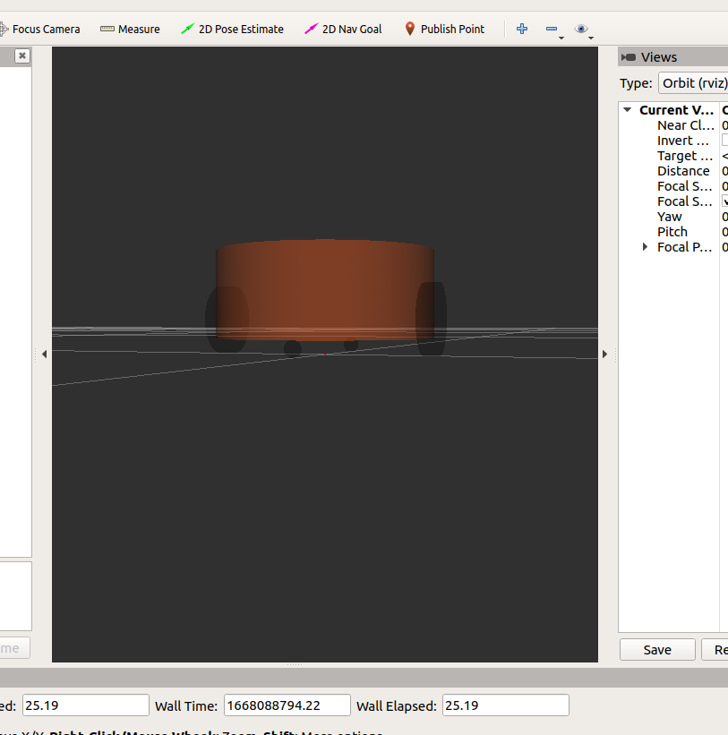

## 实操(P261~P265)——可以将不同组件设置进单独文件，最终通过文件包实现组件的拼装

#### 关于打完之后会报错的小技巧

> 类似下面这样

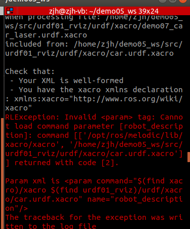

向上拉一点就可以看到出错的问题在哪里

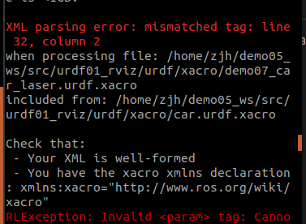

> car.launch

```markdown
<launch>
    <!-- 1.在服务器中载入urdf -->
    <!-- <param name = "robot_description" command = "$(find urdf01_rviz)/urdf/xacro/demo05_car_base.urdf"/> -->
    <param name = "robot_description" command = "$(find xacro)/xacro $(find urdf01_rviz)/urdf/xacro/car.urdf.xacro"/>

    <!-- 2.启动rviz -->
    <node pkg = "rviz"  name = "rviz" type = "rviz" args = "-d $(find urdf01_rviz)/config/show_mycar.rviz"/>

    <!-- 3.添加关节状态发布节点 -->
    <node pkg = "joint_state_publisher"  name = "joint_state_publisher" type = "joint_state_publisher"/>

    <!-- 4.添加机器人状态发布节点 --> 
    <node pkg = "robot_state_publisher"  name = "robot_state_publisher" type = "robot_state_publisher"/>

    <!-- 5.关节运动控制节点 -->
    <node pkg = "joint_state_publisher_gui"  name = "joint_state_publisher_gui" type = "joint_state_publisher_gui"/>


</launch>
```

> car.urdf.xacro

```markdown
<robot name="mycar" xmlns:xacro = "http://wiki.ros.org/xacro">
        <xacro:include filename = "demo05_car_base.urdf.xacro"/>
        <xacro:include filename = "demo06_car_camera.urdf.xacro"/>
        <xacro:include filename = "demo07_car_laser.urdf.xacro"/>

</robot>
```

> demo05_car_base.urdf.xacro

```markdown
<robot name="mycar" xmlns:xacro = "http://www.ros.org/wiki/xacro">

  <xacro:property name = "footprint_radius" value = "0.001"/>

  <link name = "base_footprint">
    <visual>
      <geometry>
        <sphere radius = "${footprint_radius}" />
      </geometry>
    </visual>
  </link>

    <xacro:property name = "base_radius" value = "0.1"/>
    <xacro:property name = "base_length" value = "0.08"/>
    <xacro:property name = "lidi" value = "0.015"/>
    <xacro:property name = "base_joint_z" value = "${base_length / 2+lidi}"/>

    <link name="base_link">
        <visual>
            <geometry>
                <cylinder radius="0.1" length="0.08" />
            </geometry>

            <origin xyz="0 0 0" rpy="0 0 0" />

            <material name="yellow">
                <color rgba="0.8 0.3 0.1 0.5" />
            </material>
        </visual>
    </link>

    <joint name="base_link2base_footprint" type="fixed">
        <parent link="base_footprint" />
        <child link="base_link"/>
        <origin xyz="0 0 0.055" />
    </joint>


<xacro:property name = "wheel_radius" value = "0.0325"/>
<xacro:property name = "wheel_length" value = "0.015"/>
<xacro:property name = "PI" value = "3.1415927"/>
<xacro:property name = "wheel_joint_z" value = "${-base_length/2-lidi+wheel_radius}"/>

<xacro:macro name = "wheel_func" params = "wheel_name flag">
  <link name = "${wheel_name}_wheel">
    <visual>
      <geometry>
        <cylinder radius = "${wheel_radius}" length = "${wheel_length}"/>
      </geometry>

      <origin xyz = "0 0 0" rpy = "${PI / 2} 0 0"/>

      <material name = "wheel_color">
        <color rgba = "0 0 0 0.3"/>
      </material>
    </visual>
  </link>

  <joint name = "${wheel_name}2link" type = "continuous">
    <parent link = "base_link"/>
    <child link = "${wheel_name}_wheel"/>
    <origin xyz = "0 ${0.1* flag} ${wheel_joint_z}" rpy = "0 0 0"/>
    <axis xyz = "0 1 0"/>
  </joint>

  </xacro:macro>

  <xacro:wheel_func wheel_name = "left" flag = "1"/>
  <xacro:wheel_func wheel_name = "right" flag = "-1"/>


  <xacro:property name = "small_wheel_radius" value = "0.0075"/>
  <xacro:property name = "small_joint_z" value = "${(base_length / 2 + lidi - small_wheel_radius)* -1}"/>

  <xacro:macro name = "small_wheel_func" params = "small_wheel_name flag">
    <link name = "${small_wheel_name}_wheel">
      <visual>
        <geometry>
          <sphere radius = "${small_wheel_radius}"/>
        </geometry>

        <origin xyz = "0 0 0" rpy = "0 0 0" />

        <material name = "wheel_color">
          <color rgba = "0 0 0 0.3"/>
        </material>
      </visual>
    </link>

    <joint name = "${small_wheel_name}2link" type = "continuous">
      <parent link = "base_link" />
      <child link = "${small_wheel_name}_wheel" />

      <origin xyz = "${0.08 * flag} 0 ${small_joint_z}" rpy = "0 0 0"/>
      <axis xyz = "0 1 0"/>
    </joint>
  </xacro:macro>

  <xacro:small_wheel_func small_wheel_name = "front" flag = "1"/>
  <xacro:small_wheel_func small_wheel_name = "back" flag = "-1"/>
</robot>
```

> demo06_car_camera.urdf.xacro

```markdown
<robot name="mycar" xmlns:xacro = "http://wiki.ros.org/xacro">


        <xacro:property name = "camera_length" value = "0.02"/>
        <xacro:property name = "camera_width" value = "0.05"/>
        <xacro:property name = "camera_height" value = "0.05"/>

        <xacro:property name = "joint_camera_x" value = "0.08"/>
        <xacro:property name = "joint_camera_y" value = "0"/>
        <xacro:property name = "joint_camera_z" value = "${base_length / 2 + camera_height / 2}"/>

        <link name = "camera">
                <visual>
                        <geometry>
                                <box size = " ${camera_length}  ${camera_width} ${camera_height} " />
                        </geometry>

                        <origin xyz="0.0 0.0 0.0" rpy="0.0 0.0 0.0" />
                        <material name = "black">
                                <color rgba = "0 0 0 0.8"/>
                        </material>
                </visual>
        </link>
        <joint name = "camera2base" type = "fixed">
                <parent link = "base_link"/>
                <child link = "camera"/>
                <origin xyz = "${joint_camera_x} ${joint_camera_y} ${joint_camera_z}" rpy = "0 0 0"/>

        </joint>
</robot>
```

> demo07_car_laser.urdf.xacro

```markdown
<robot name="mycar" xmlns:xacro = "http://wiki.ros.org/xacro">

        <xacro:property name = "support_radius" value = "0.01" />
        <xacro:property name = "support_length" value = "0.15" />
        <xacro:property name = "laser_radius" value = "0.03" />
        <xacro:property name = "laser_length" value = "0.05" />

        <xacro:property name = "joint_support_x" value = "0" />
        <xacro:property name = "joint_support_y" value = "0" />
        <xacro:property name = "joint_support_z" value = "${base_length /2 +support_length / 2}" />

        <xacro:property name = "joint_laser_x" value = "0" />
        <xacro:property name = "joint_laser_y" value = "0" />
        <xacro:property name = "joint_laser_z" value = "${base_length /2 +laser_length / 2}" />

        <link name = "support">
                <visual>
                        <geometry>
                                <cylinder radius = "${support_radius}" length = "${support_length}" />
                        </geometry>

                        <material name ="yellow">
                                <color rgba = "0.0 0.5 0.0 0.5" />
                        </material>
                </visual>
        </link>

                <joint name = "support2base" type = "fixed">
                        <parent link = "base_link" />
                        <child  link = "support"/>
                        <origin xyz = "${joint_support_x} ${joint_support_y} ${joint_support_z}" rpy = "0 0 0" />
                </joint>

        <link name = "laser">
                <visual>
                        <geometry>
                                <cylinder radius = "${laser_radius}" length = "${laser_length}" />
                        </geometry>

                        <material name ="black">
                                <color rgba = "0.0 0.0 0.0 0.5" />
                        </material>
                </visual>
        </link>

                <joint name = "laser2support" type = "fixed">
                        <parent link = "support" />
                        <child  link = "laser"/>
                        <origin xyz = "${joint_laser_x} ${joint_laser_y} ${joint_laser_z}" rpy = "0 0 0" />
                </joint>
                
</robot>
```

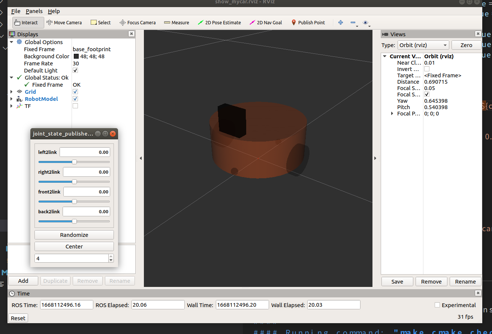

#### 关于`<robot name="mycar">`

即使更改camera和laser中的标签，小车的全称仍然跟着总文件中的名字相同

即

```
在demo06中，第一行改为<robot name="my_camera" xmlns:xacro = "http://wiki.ros.org/xacro">
在demo07中，第一行改为<robot name="my_laser" xmlns:xacro = "http://wiki.ros.org/xacro">
使用 rosrun xacro xacro car.urdf.xacro 结果相同
```

## P267~P270 arbotix

> 安装指令`sudo apt-get install ros-melodic-arbotix`

> 在control.yaml中

```markdown
# 该文件是控制器配置,一个机器人模型可能有多个控制器，比如: 底盘、机械臂、夹持器(机械手)....
# 因此，根 name 是 controller
controllers: {
   # 单控制器设置
   base_controller: {
          #类型: 差速控制器
       type: diff_controller,
       #参考坐标
       base_frame_id: base_footprint, 
       #两个轮子之间的间距
       base_width: 0.2,
       #控制频率
       ticks_meter: 2000, 
       #PID控制参数，使机器人车轮快速达到预期速度
       Kp: 12, 
       Kd: 12, 
       Ki: 0, 
       Ko: 50, 
       #加速限制
       accel_limit: 1.0 
    }
}
```

> 在demo07_control.launch中

```markdown
<launch>
    <!-- 1.在服务器中载入urdf -->
    <!-- <param name = "robot_description" command = "$(find urdf01_rviz)/urdf/xacro/demo05_car_base.urdf"/> -->
    <param name = "robot_description" command = "$(find xacro)/xacro $(find urdf01_rviz)/urdf/xacro/car.urdf.xacro"/>

    <!-- 2.启动rviz -->
    <node pkg = "rviz"  name = "rviz" type = "rviz" args = "-d $(find urdf01_rviz)/config/show_mycar.rviz"/>

    <!-- 3.添加关节状态发布节点 -->
    <node pkg = "joint_state_publisher"  name = "joint_state_publisher" type = "joint_state_publisher"/>

    <!-- 4.添加机器人状态发布节点 --> 
    <node pkg = "robot_state_publisher"  name = "robot_state_publisher" type = "robot_state_publisher"/>

    <!-- 5.关节运动控制节点 -->
    <node pkg = "joint_state_publisher_gui"  name = "joint_state_publisher_gui" type = "joint_state_publisher_gui"/>

    <!-- 集成 arbotix 运动控制节点,并加载相应参数 -->
    <node pkg = "arbotix_python" type = "arbotix_driver" name = "driver" output = "screen">
        <rosparam command = "load"  file = "$(find urdf01_rviz)/config/control.yaml" />
        <param name = "sim" value = "true" />

    </node>
</launch>
```

在`rosrun`下，`arbotix_python`下有一个专门的驱动节点：`arbotix_driver`,因此对应控制节点的类型`type="arbotix_driver"`

对应了上方的`pkg = "arbotix_python" type = "arbotix_driver"`的部分，`name`为自取名称

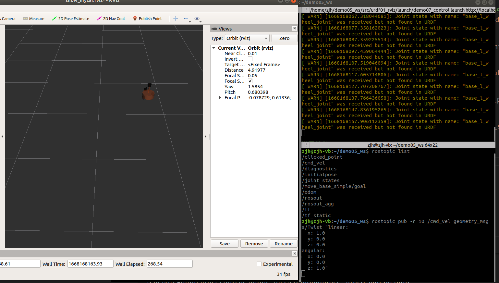

成功运行后，可以使用`rostopic list`对话题进行查看，而`/cmd_vel`为操控节点

输入`rostopic pub -r 10 /cmd_vel`后一直按`Tab`可以按照需要对运动方式进行编辑

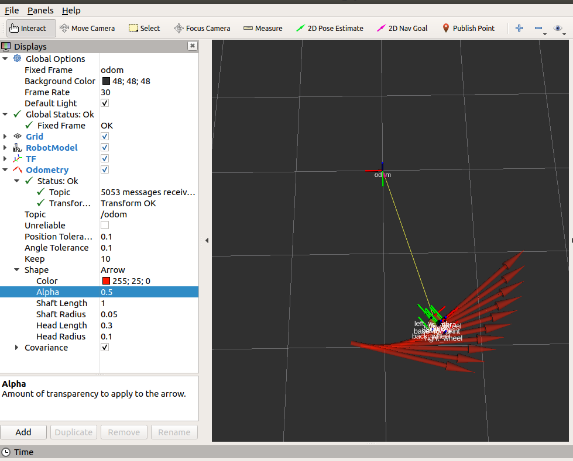

> 按照教程，需要把Fixed Frame中更改为Odom

在左下角的`Add`中添加`Odometry`可以获得到如图中的红色箭头

> 其中：
>
> Color可以调整箭头颜色
>
> Alpha可以调整不透明度
>
> Shaft Length可以调整箭头的箭身长度
>
> Shaft Radius可以调整箭头的的箭身直径
>
> Head针对箭头的头部分

添加`TF`可以获得如中每个核心部分的坐标轴

## P271~P277Gazebo

可以使用`roslaunch gazebo_ros empty_world.launch`来开启gazebo界面（相当于打开了一个预设默认的空文件）

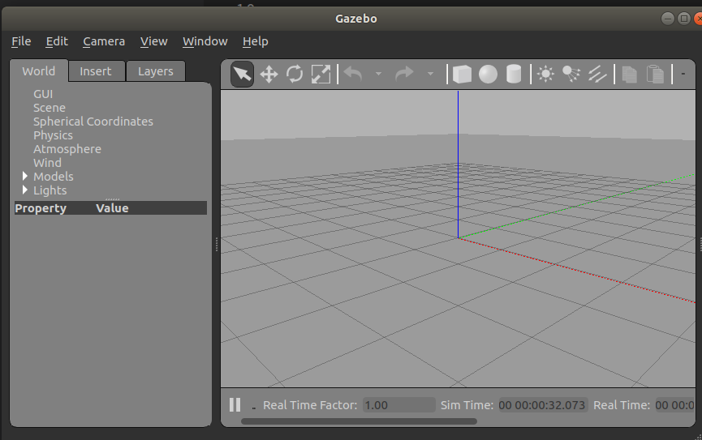

对应了下面`launch`文件的第二步

> demo01_helloworld.launch

```markdown
<launch>
        <param name = "robot_description" textfile = "$(find urdf02_gazebo)/urdf/demo01_helloworld.urdf"/>
        <include file="$(find gazebo_ros)/launch/empty_world.launch" />
        <node pkg="gazebo_ros" type="spawn_model" name="model" args="-urdf -model mycar -param robot_description"  />
</launch>
```

> demo01_helloworld.urdf

```markdown
<robot name = "mycar">
        <link name = "base_link">

                <visual>
                        <geometry>
                                <box size = "0.5 0.3 0.1" />
                        </geometry>
                        <origin xyz= "0.0 0.0 0.0" rpy = "0.0 0.0 0.0"/>
                        <material name = "yellow">
                                <color rgba = "0.5 0.3 0.0 0.5" />
                        </material>
                </visual>

                <collision>
                        <geometry>
                                <box size = "0.5 0.3 0.1" />
                        </geometry>
                        
                        <origin xyz = "0.0 0.0 0.0" rpy = "0.0 0.0 0.0"/>
                </collision>

                <inertial>
                        <origin xyz = "0 0 0"/>
                        <mass value = "2"/>
                        <inertia ixx="1" ixy="0" ixz="0" iyy="1" iyz="0" izz="1" />
                </inertial>

        </link>

        <gazebo reference = "base_link">
                <material>Gazebo/Red</material>
        </gazebo>
</robot>
```

**在launch文件没有打出第三行时，运行`rosrun gazebo_ros spawn_model -urdf -model car -param robot_description`会一直报错，这里先不用管，直接按照后面教程走就行**

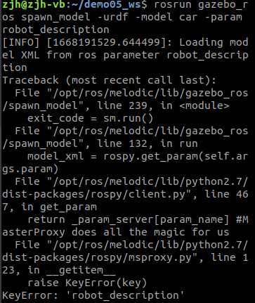

> 注意， 当 URDF 需要与 Gazebo 集成时，和 Rviz 有明显区别:
>
> 1.必须使用 collision 标签，因为既然是仿真环境，那么必然涉及到碰撞检测，collision 提供碰撞检测的依据。
>
> 2.必须使用 inertial 标签，此标签标注了当前机器人某个刚体部分的惯性矩阵，用于一些力学相关的仿真计算。
>
> 3.颜色设置，也需要重新使用 gazebo 标签标注，因为之前的颜色设置为了方便调试包含透明度，仿真环境下没有此选项。
